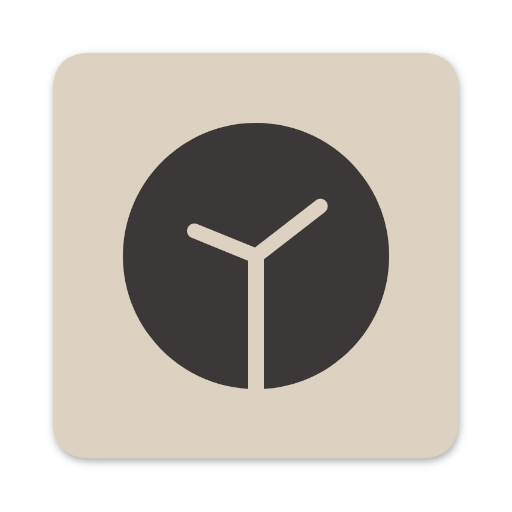

<p align="center">
  
</p>

# Time-Tablet

Introducing my versatile Timetable and Attendance App, crafted with Flutter and powered by Firestore! This intuitive app allows users to seamlessly manage their schedules and track attendance. With a sleek and user-friendly interface, users can easily view, add, and modify events in their timetable. The real-time synchronization with Firestore API ensures that all changes are instantly updated across devices, making it perfect for students, teachers, and professionals alike!

## Table of Contents

- [Features](#features)
- [Installation](#installation)
- [Contributing](#contributing)
- [License](#license)
- [Acknowledgements](#acknowledgements)

## Features

- **User Authentication**: Separate login and signup interfaces for users.
- **Synchronization Across Devices**: 
  - Add, delete, and view your Events Across multiple Devices.
  - Unique Events for each Credentials.
  - Real Time Updates using Firestore API.
- **User Interface**:
  - Able to Add multiple courses on different days with centralized attendance.
- **Database Management**: Handles database creation and table management.

## Installation

1. **Clone the repository**:
    ```bash
    git clone https://github.com/aadityaa-yadav3/Time-Tablet.git
    cd Time-Tablet
    ```

2. **Install Dependencies**:
    ```bash
    flutter pub get
    ```

3. **Configure Firestore**:
    - Create a Firebase project at the Firebase Console.
    - Add an Android and/or iOS app to your Firebase project and follow the setup instructions.
    - Download the ___'google-services.json'___ file for Android and/or ___'GoogleService-Info.plist'___ file for iOS and place them in the respective directories in your Flutter project:
      - ___'android/app'___ for ___'google-services.json'___
      - ___'ios/Runner'___ for ___'GoogleService-Info.plist'___
    - Ensure that you have configured Firestore in the Firebase console.
    
4. **Run the application & build for your platform**:
    ```bash
    flutter run
    flutter build apk
    ```
   (to build the app on Anrdoid Platform)
    ```bash
    flutter run
    flutter build apk
    ```
   (to build the app on Apple's iOS Platform)

## Prerequisites
- Before you begin, ensure you have the following installed:

  - Flutter SDK
  - Dart SDK
  - Git
  - An IDE (e.g., Visual Studio Code or Android Studio)

## Contributing

Contributions are welcome! Please fork the repository and submit a pull request with your changes. Ensure that your code adheres to the project's coding standards.

## License

This project is ___not___ licensed under the MIT License. See the [LICENSE](LICENSE) file for details. lol :)

## Acknowledgements

- [Flutter](https://docs.flutter.dev/) for the Enviorment.
- [Firestore](https://firebase.google.com/docs/firestore) for the Backend and Authorization.
- Community contributions and feedback.
